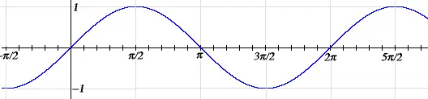
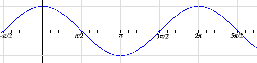
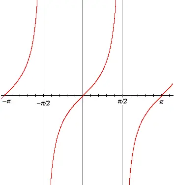
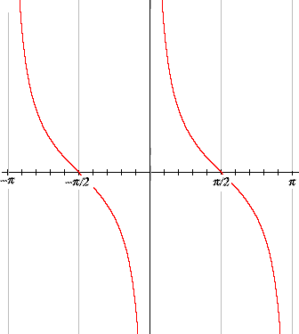
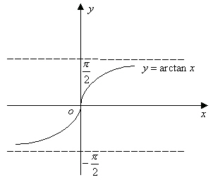
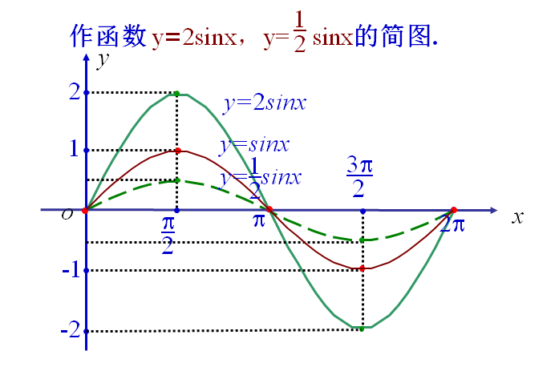
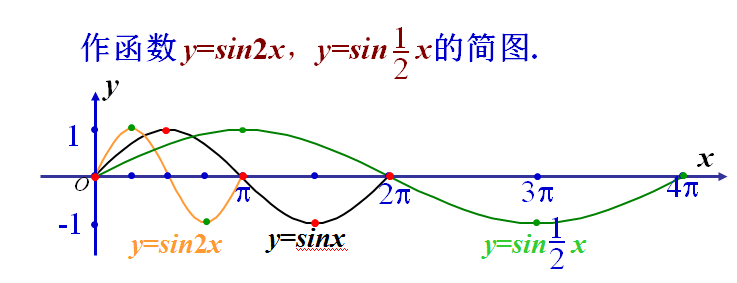
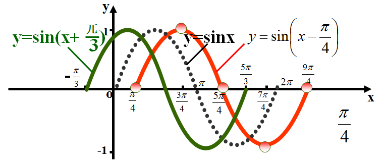

# 三角函数

## 目录

-   [性质](#性质)
-   [公式](#公式)

<!---->

-   基本三角函数
    -   sin
        -   图像

            
        -   性质
            | 类型     | 说明                                                       |
            | ------ | -------------------------------------------------------- |
            | 定义域    | R                                                        |
            | 值域     | \[-1,1]                                                  |
            | 单调递增区间 | $[2k\pi - \frac{\pi}{2},2k\pi + \frac{\pi}{2}],k \in Z$  |
            | 单调递减区间 | $[2k\pi + \frac{\pi}{2},2k\pi + \frac{3\pi}{2}],k \in Z$ |
            | 奇偶性    | 奇函数                                                      |
            | 对称轴    | $x=k\pi + \frac{\pi}{2},k\in Z$                          |
            | 堆成中心对称 | $(k\pi,0),k\in Z$                                        |
            | 最小正周期  | $2\pi$                                                   |
    -   cos
        -   图像

            
        -   性质
            | 类型     | 说明                              |
            | ------ | ------------------------------- |
            | 定义域    | R                               |
            | 值域     | \[-1,1]                         |
            | 单调递增区间 | $[2k\pi - \pi,2k\pi],k \in Z$   |
            | 单调递减区间 | $[2k\pi,2k\pi +\pi],k \in Z$    |
            | 奇偶性    | 偶函数                             |
            | 对称轴    | $x=k\pi,k\in Z$                 |
            | 对称中心   | $(k\pi+\frac{\pi}{2},0),k\in Z$ |
            | 最小正周期  | $2\pi$                          |
    -   tan
        -   图像

            
        -   性质
            | 类型     | 说明                                                  |                                     |
            | ------ | --------------------------------------------------- | ----------------------------------- |
            | 定义域    | \${x                                                | x\neq k\pi +\frac{\pi}{2},k\in Z}\$ |
            | 值域     | R                                                   |                                     |
            | 单调递增区间 | $[k\pi - \frac{\pi}{2},k\pi+\frac{\pi}{2}],k \in Z$ |                                     |
            | 单调递减区间 | 无                                                   |                                     |
            | 奇偶性    | 奇函数                                                 |                                     |
            | 对称轴    | 无                                                   |                                     |
            | 对称中心   | $(\frac{k\pi}{2},0),k\in Z$                         |                                     |
            | 最小正周期  | $\pi$                                               |                                     |
    -   cot
        -   图像

            
        -   性质
            | 类型     | 说明                                                  |                      |
            | ------ | --------------------------------------------------- | -------------------- |
            | 定义域    | \${x                                                | x\neq k\pi,k\in Z}\$ |
            | 值域     | R                                                   |                      |
            | 单调递增区间 | 无                                                   |                      |
            | 单调递减区间 | $[k\pi - \frac{\pi}{2},k\pi+\frac{\pi}{2}],k \in Z$ |                      |
            | 奇偶性    | 奇函数                                                 |                      |
            | 对称轴    | 无                                                   |                      |
            | 对称中心   | $(\frac{k\pi}{2},0),k\in Z$                         |                      |
            | 最小正周期  | $\pi$                                               |                      |
    -   sec
        -   图像

            
        -   性质
            | 类型     | 说明                          |                                               |
            | ------ | --------------------------- | --------------------------------------------- |
            | 表达式    | $y=\sec x=\frac{1}{\cos x}$ |                                               |
            | 定义域    | \${x                        | -\frac{k\pi}{2} \leq x \leq \frac{k\pi}{2}}\$ |
            | 值域     |                             |                                               |
            | 单调递增区间 |                             |                                               |
            | 单调递减区间 |                             |                                               |
            | 奇偶性    |                             |                                               |
            | 对称轴    |                             |                                               |
            | 对称中心   |                             |                                               |
            | 最小正周期  |                             |                                               |
    -   csc
        -   图像

            
-   反三角函数
    -   arcsin
        -   表达式
            $$
            y=\arcsin x (-1\leq x\leq 1)
            $$
        -   图像

            
    -   arccos
        -   表达式
            $$
            y=\arccos x (-1\leq x\leq 1)
            $$
        -   图像

            
    -   arctan
        -   表达式
            $$
            y=\arctan x,x \in(-\infty,\infty)
            $$
        -   图像

            

# 性质

-   振幅变换
    $$
    y=Asinx\\
    概念：A称为振幅，A发生变化时，叫做振幅变换\\
    特点：A变大时，拉长A倍。A变小时，压缩A倍\\
    值域：[-A,A]\\ 
    $$
    
-   周期变换
    $$
    y=sin\omega x ,\omega=\frac{2\pi}{T} \\
    概念：其中T为周期，\omega发生变化时，周期也随之变化 \\
    特点： \omega 变大（小）时，纵坐标变窄（宽）\frac{1}{\omega}倍的周期
    $$
    
-   相位变换
    $$
    y=sin(\omega x+\varphi)\\
    概念： (\omega x+\varphi)为相位，\varphi为初相 \\
    特点：平移变化，+\varphi为 x向左平移,-\varphi为向右平移
    $$
    

# 公式

-   诱导公式
    $$
    目的：\\
    将三角函数中的(\frac{k\pi}{2} + \alpha)中的\frac{k\pi}{2}去掉,仅保留\alpha

    $$
    $$
    记忆:\\
    前提1\ sin和ces的正负取决于y\\
    前提2\ cos 和 sec的正负取决于x\\
    前提3\ tan和cot的正负取决于\frac{y}{x}
    $$
-   平方关系
    $$
    sin^2\alpha + cos^2=1

    $$
    $$
    sec^2\alpha=1+tan^2\alpha

    $$
    $$
    csc^2\alpha=1+cot^2\alpha
    $$
-   同角公式
    $$
    tan\alpha\ cot\alpha =1

    $$
    $$
    sin\alpha\ csc\alpha =1

    $$
    $$
    cos\alpha\ sec\alpha =1

    $$
-   和差公式
    $$
    sin(\alpha \pm \beta)=sin\alpha\ cos\beta \pm cos\alpha\ sin\beta
    $$
    $$
    cos(\alpha \pm \beta)=cos\alpha\ cos\beta \mp sin\alpha\ sin\beta
    $$
    $$
    tan(\alpha \pm \beta)=\frac{tan\alpha \pm tan \beta}{1 \mp tan\alpha\ tan\beta}
    $$
-   半角公式
    $$
    sin\frac{\alpha}{2}\ =\ \pm \sqrt{\frac{1-cos\alpha}{2}}
    $$
    $$
    cos\frac{\alpha}{2}\ =\ \pm \sqrt{\frac{1+cos\alpha}{2}}
    $$
    $$
    tan\frac{\alpha}{2}\ =\ \frac{1-cos\alpha}{sin\alpha}\ =\ \frac{sin\alpha}{1-cos\alpha}
    $$
-   倍角公式
    $$
    sin\ 2\alpha\ =\ \frac{2tan\ \alpha}{1+tan^2\alpha}\ =\ 2sin\ \alpha cos\ \alpha

    $$
    $$
    cos\ 2\alpha\ =\ \frac{1-tan^2\ \alpha}{1+tan^2\alpha}\ =\ cos^2\ \alpha-sin^2\ \alpha\ =\ 2cos^2\ \alpha -1\ =\ 1-2sin^2\ \alpha
    $$
    $$
    tan\ 2\alpha\ =\ \frac{2tan\ \alpha}{1-tan^2\alpha}
    $$
-   降幂公式
    $$
    sin^2\alpha\ =\ \frac{1-cos2\alpha}{2}
    $$
    $$
    cos^2\alpha\ =\ \frac{1+cos2\alpha}{2}
    $$
-   拆分角公式
    $$
    cos^2\alpha-sin^2\beta=cos(\alpha + \beta)\ cos(\alpha - \beta)\\
    $$
-   积化和差
    $$
    sin\alpha\ cos\beta = \frac{1}{2}[sin(\alpha+\beta)+sin(\alpha-\beta)]
    $$
    $$
    cos\alpha\ cos\beta = \frac{1}{2}[cos(\alpha+\beta)+cos(\alpha-\beta)]
    $$
    $$
    sin\alpha\ sin\beta = -\frac{1}{2}[cos(\alpha+\beta)-cos(\alpha-\beta)]
    $$
-   和差积化
    $$
    sin\alpha + sin\beta=2sin\frac{\alpha+\beta}{2}cos\frac{\alpha - \beta}{2}
    $$
    $$
    sin\alpha - sin\beta=cos\frac{\alpha+\beta}{2}sin\frac{\alpha - \beta}{2}
    $$
    $$
    cos\alpha + cos\beta=cos\frac{\alpha+\beta}{2}cos\frac{\alpha - \beta}{2}
    $$
    $$
    cos\alpha - cos\beta=sin\frac{\alpha+\beta}{2}sin\frac{\alpha - \beta}{2}
    $$
