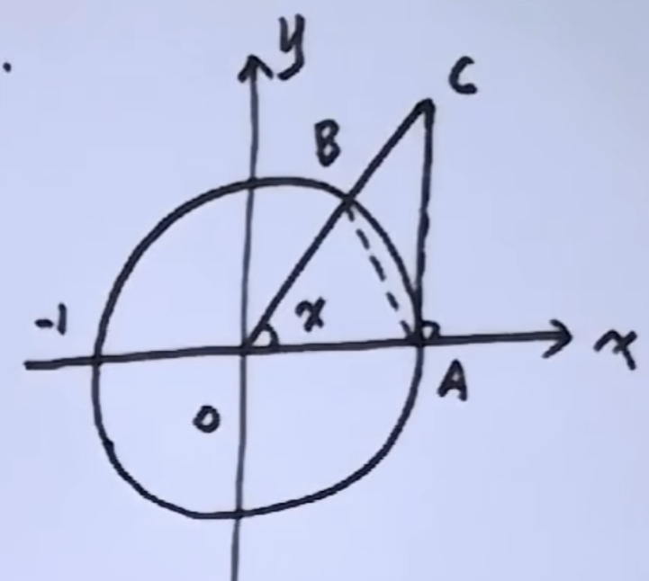
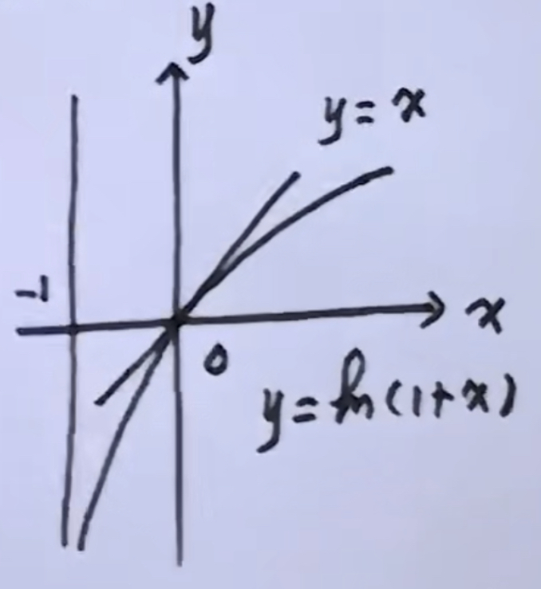
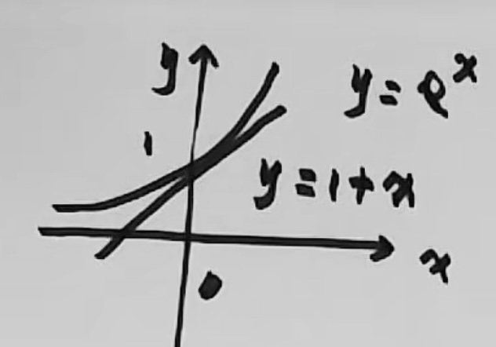

# 不等式

## 目录

-   [重要不等式](#重要不等式)
-   [三角不等式](#三角不等式)
-   [算术-几何不等式(AM-GM不等式)](#算术-几何不等式AM-GM不等式)
-   [柯西不等式](#柯西不等式)

[其他几个不等式](https://www.bilibili.com/video/BV1A3411v7Jk?p=5\&vd_source=70bfffb58b52aee85c1a7d90a1d89e68 "其他几个不等式")

# 重要不等式

不等式1

$$
在0<x<\frac{\pi}{2}中\\ 
S_{\triangle AoB} =\frac{1}{2}\sin x,S_{扇AoB}=\frac{1}{2}x,S_{AoC}=\frac{1}{2}\tan x

$$

$$
结论：0<\sin x<x<\tan x 
$$

图像

不等式2

$$
x> -1时，\ln(1+x) \leq x
$$

$$

x >-1且x \neq 0时, \ln (1+x) < x 
$$

图像

不等式3

$$
x \in (-\infty,+\infty)时，e^x\geq1+x
$$

$$
x \neq 0时，e^x > 1+x 
$$

图像

不等式4

$$
0<\sin x < \cos x < 1 <\cot x (x\in\frac{\pi}{4})
$$

# 三角不等式

$$
\big| |a| -|b| \big| \leq \big| a-b \big| \leq |a| + |b|
$$

# 算术-几何不等式(AM-GM不等式)

$$
a^2 +b^2 \geq 2ab 
$$

$$
|ab| \leq \frac{a^2+b^2}{2}
$$

$$
a_n + \frac{1}{n}  \geq 2
$$

$$
\frac{a_1 + a_2 + \cdots + a_n}{n} \geq \sqrt[n]{a_1 a_2 \cdots a_n}
$$

# 柯西不等式

$$
设a_i,b_i(i=1,2,...,n)为两组常数，则 \\
(a_1b_1+a_2b_2+...+a_nb_n)^2  \leq (a^2_1+a^2_2+...+a^2_n)(b^2_1+b^2_2+...+b^2_n)
$$
