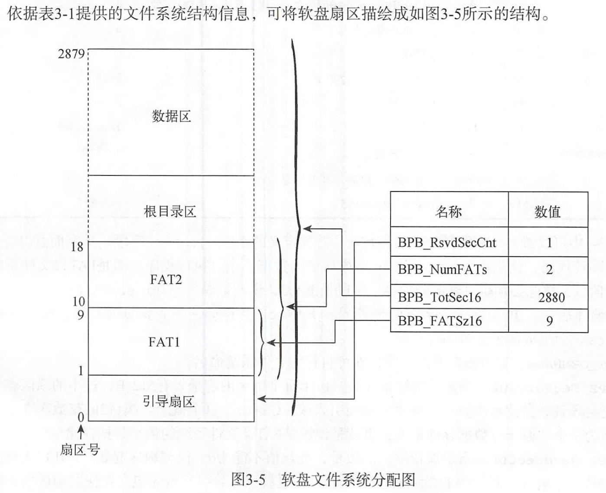

# FAT12文件系统

## 目录

-   [文件结构分配图](#文件结构分配图)
-   [扇区](#扇区)
-   [簇](#簇)
-   [引导扇区](#引导扇区)
-   [FAT表](#FAT表)
-   [根目录区](#根目录区)
-   [数据区](#数据区)

> 参考链接:
> [https://academy.cba.mit.edu/classes/networking\_communications/SD/FAT.pdf](https://academy.cba.mit.edu/classes/networking_communications/SD/FAT.pdf "https://academy.cba.mit.edu/classes/networking_communications/SD/FAT.pdf")[https://zhuanlan.zhihu.com/p/121807427](https://zhuanlan.zhihu.com/p/121807427 "https://zhuanlan.zhihu.com/p/121807427")

专门为1.44MB的软盘设计的，不区分大小写

# 文件结构分配图

# 扇区

单扇区大小：512B

FAT12系统总扇区数：2880个=1.44MB / 512B

单扇区目录数:512B/32B=16d=10h个目录

# 簇

说明：FAT12文件系统以簇为单位来分配数据区的存储空间(扇区)，簇将2的整数次方个扇区作为一个“原子”数据存储单元。

定义：簇是FAT类文件系统的最小数据存储单位。每12个字节为一个簇（因此是FAT12名称的来源）

长度：BPB\_BytesPreSec(每扇区字节数) \* BPB\_SecPerClus(每簇扇区数) 个字节

内容：12个二进制数字表示这个簇指向的下一个簇，这就形成了一个链表，链表的空指针NULL（结尾标志），使用0xFFF表示。
作用：每个簇映射到一个扇区上。

注意：即使文件的长度只有一个字节，FAT12文件系统也会为它分配一个簇的磁盘存储空间。&#x20;

# 引导扇区

-   包含

    引导程序、文件系统的组成结构信息（对磁盘扇区的管理情况）
-   表格
    | 名称               | 偏移  | 长度(字节) | 内容                           | 数据                          | 备注                                                                                                                                        |
    | ---------------- | --- | ------ | ---------------------------- | --------------------------- | ----------------------------------------------------------------------------------------------------------------------------------------- |
    | BS\_jmpBoot      | 0   | 3      | 跳转指令                         | jump short Label\_Start nop |                                                                                                                                           |
    | BS\_OEMName      | 3   | 8      | 生产厂商名                        | 'MINEboot'                  | 自行为文件系统命名                                                                                                                                 |
    | BPB\_BytesPreSec | 11  | 2      | 每扇区字节数                       | 512                         |                                                                                                                                           |
    | BPB\_SecPerClus  | 13  | 1      | 每簇扇区数                        | 1                           | 由于每个扇区的容量只有512B，过小的扇区容量可能会导致软盘读写次数过于频繁，从而引入簇(Cluster)这个概念。簇将2的整数次方个扇区作为一个“原子”数据存储单元，也就是说簇是FAT类文件系统的最小数据存储单位。                              |
    | BPB\_RsvdSeCnt   | 14  | 2      | 保留扇区数                        | 1                           | 此域值不能为0。保留扇区起始于FAT12文件系统的第一个扇区，对于FAT12而言此位必须为1，也就意味着引导扇区包含在保留扇区内，所以FAT表从软盘的第二个扇区开始                                                        |
    | BPB\_NumFats     | 16  | 1      | FAT表的份数                      | 2                           | 指定FAT12文件系统中FAT表的份数，任何FAT类文件系统都建议此域设置为2。设置为2主要是为了给FAT表准备一个备份表，因此FAT表1与FAT表2内的数据是一样的，FAT表2是FAT表1的数据备份表。                                    |
    | BPB\_RootEntCnt  | 17  | 2      | 根目录可容纳的目录项数                  | 224                         | 指定根目录可容纳的目录项数。对于FAT12文件系统而言，这个数值乘以32必须是BPB\_BytesPerSec的偶数倍。224\*32=512\*14                                                               |
    | BPB\_TotSec16    | 19  | 2      | 总扇区数                         | 2880                        | 这里的总扇区数包括保留扇区(内含引导扇区)、FAT表、根目录区以及数据区占用的全部扇区数，如果此域值为0，那么BPB\_TotSec32字段必须是非0值。                                                             |
    | BPB\_Media       | 21  | 1      | 介质描述符                        | 0xF0                        | 对于不可移动的存储介质而言，标准值是0xF8。对于可移动的存储介质，常用值为0xF0，此域的合法值是0x8、0xF9、0xF0、0xFA、0xFB、0xFC、0xFD、0xFE、0xFF。另外提醒一点，无论该字段写入了什么数值，同时也必须向FAT\[0]的低字节写入相同值。 |
    | BPB\_FATSz16     | 22  | 2      | 每FAT扇区数                      | 9                           | FAT表1和FAT表2拥有相同的容量，它们的容量均由此值记录。                                                                                                           |
    | BPB\_SecPerTrk   | 24  | 2      | 每磁道扇区数                       | 18                          |                                                                                                                                           |
    | BPB\_NumHeads    | 26  | 2      | 磁头数                          | 2                           |                                                                                                                                           |
    | BPB\_HiddSec     | 28  | 4      | 隐藏扇区数                        | 0                           |                                                                                                                                           |
    | BPB\_TotSec32    | 32  | 4      | 如果BPB\_TotSec16=0,则由这个值记录扇区数 | 0                           |                                                                                                                                           |
    | BS\_DrvNum       | 36  | 1      | int 13h的驱动器号                 | 0                           |                                                                                                                                           |
    | BS\_Reserved1    | 37  | 1      | 未使用                          | 0                           |                                                                                                                                           |
    | BS\_BootSig      | 38  | 1      | 扩展引导标记（29h）                  | 0x29                        |                                                                                                                                           |
    | BS\_VolID        | 39  | 4      | 卷序列号                         | 0                           |                                                                                                                                           |
    | BS\_VolLab       | 43  | 11     | 卷标                           | 'boot loader'               | 它就是Windows或Linux系统中显示的磁盘名。                                                                                                                |
    | BS\_FileSysType  | 54  | 8      | 文件系统类型                       | 'FAT12'                     | 这个类型值只是一个字符串而己，操作系统并不使用该字段来鉴别FAT类文件系统的类型。                                                                                                 |
    | 引导代码             | 62  | 448    | 引导代码、即其他数据                   |                             |                                                                                                                                           |
    | 结束标志             | 510 | 2      | 结束标志                         | 0xAA55                      |                                                                                                                                           |

# FAT表

位宽：12bit

扇区数：9个

单表扇区总大小：9个 \* \* \*512B= 4.5KB

单表总簇数：9个  \* 512 B / 12bit = 3072个

FAT表2的作用：作为FAT1的备份表

-   表现值
    | FAT项 | 实例值  | 描述                               |
    | ---- | ---- | -------------------------------- |
    | 0    | FF0h | 磁盘标志字，低字节与BPB\_Media保持一致，其他位设置为0 |
    | 1    | FFFh | 第一个簇已经被占用                        |
    | 2    | 003h | 000h：可用簇                         |
    | 3    | 004h | 002h至FEFh：已用簇，标志下一个簇的簇号          |
    | ...  | ...  | FF0至FF6h：保留簇                     |
    | N    | FFFh | FF7：坏簇                           |
    | N+1  | 000h | FF8h至FFFh：文件的最后一个簇               |

# 根目录区

保存目录项信息

大小：32B

可容纳的目录项数：224

起始扇区号：1(引导扇区)+9( FAT表的扇区数)\* 2(FAT表的份数)=19

总扇区数：14个=224(根目录可容纳的目录项数) \* 32B(大小)\* \*/ 512(每个扇区大小) -1

# 数据区

保存目录项信息系和保存文件内的数据

大小：32B

总扇区数：2847个=2880(总扇区数)-1(引导扇区)-9(FAT表1)-9(FAT表2)-14(根目录区)

-   目录项结构
    | 名称            | 偏移   | 长度  | 描述                                |
    | ------------- | ---- | --- | --------------------------------- |
    | DIR\_Name     | 0x00 | 11  | 文件名8B，扩展名3CB                      |
    | DIR\_Attr     | 0x0B | 1   | 文件属性：0x27隐藏文件，目录0x10，普通文件0x20     |
    | 保留            | 0x0C | 110 | 保留                                |
    | DIR\_WrtTime  | 0X16 | 2   | 最后一次写入时间                          |
    | DIR\_WrtDate  | 0X18 | 2   | 最后一次写入日期                          |
    | DIR\_FstClus  | 0X1A | 2   | 起始簇号，FAT\[0]和FAT\[1]是保留项，有效起始簇号是2 |
    | DIR\_FileSize | 0X1C | 4   | 文件大小                              |
-   文件名存储
    | 用户确定的文件名/目录名   | DIR\_Name字段存储内容 |
    | -------------- | --------------- |
    | "foo.bar"      | "FOO  BAR"      |
    | "FOO.BAR"      | "FOO  BAR"      |
    | "Foo.Bar"      | "FOO  BAR"      |
    | "foo"          | "FOO  "         |
    | "foo."         | "FOO  "         |
    | "PICKLE.A"     | "PICKLE  A  "   |
    | "prettybg.big" | "PRETTYBGBIG"   |
    | ".big"         | "  BIG"         |
