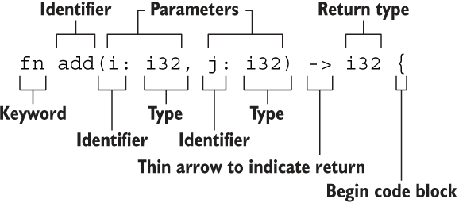

# 函数

## 目录

-   [死循环 / 不返回](#死循环--不返回)

格式



示例

```rust
fn add(i: i32, j: i32) -> i32 {
   i + j
 }
```

命名风格：蛇形命名法

返回值：应是函数体的运行到最后的表达式，而非语句。因为表达式能返回原有的类型，而语句返回();

# 死循环 / 不返回

说明：使用`!`作为函数的返回类型

```rust
fn forever() -> ! {
  loop {
    //...
  };
}
```
