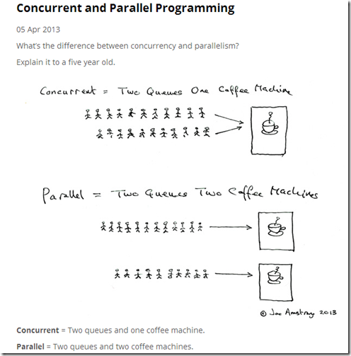

# 并发

**并发(Concurrent)** 是多个队列使用同一个咖啡机，然后两个队列轮换着使用（未必是 1:1 轮换，也可能是其它轮换规则），最终每个人都能接到咖啡

[多核心并发：](https://course.rs/advance/concurrency-with-threads/concurrency-parallelism.html#多核心并发 "多核心并发：")当核心增多到 `N` 时，操作系统同时在进行的任务肯定远不止 `N` 个，这些任务将被放入 `M` 个线程队列中，接着交给 `N` 个 CPU 核心去执行，最后实现了 `M:N` 的处理模型，在这种情况下，**并发与并行是同时在发生的，所有用户任务从表面来看都在并发的运行，但实际上，同一时刻只有 ****`N`**** 个任务能被同时并行的处理**。
